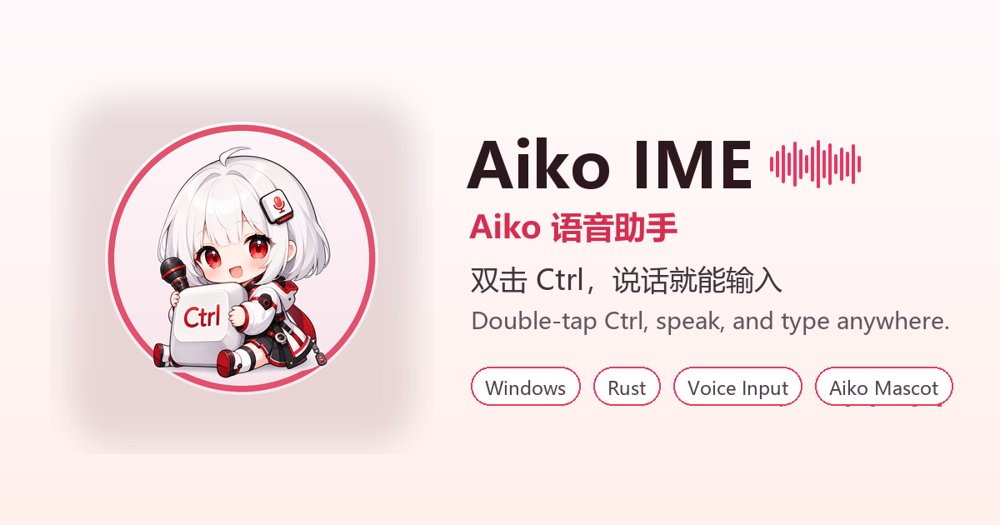

# Aiko IME



Aiko IME 是一款面向 Windows 的轻量语音输入工具，使用 Rust 编写。它通过全局热键开始录音，把麦克风音频流式发送到 ASR 后端，并通过 Win32 `SendInput` API 将识别结果输入到当前正在使用的应用里。

Aiko IME is a lightweight Windows voice input tool written in Rust. It listens for a global hotkey, records microphone audio, streams it to an ASR backend, and inserts recognized text into the currently focused application through the Win32 `SendInput` API.

本项目受 [EvanDbg/doubao-ime-win](https://github.com/EvanDbg/doubao-ime-win) 启发，并基于同类思路继续整理和改进：做一个小巧、便携、不需要安装完整输入法也能在 Windows 任意输入框里说话打字的工具。

This project is inspired by and derived from [EvanDbg/doubao-ime-win](https://github.com/EvanDbg/doubao-ime-win). It keeps the same practical idea: a small, portable dictation helper that can type anywhere on Windows without installing a full IME.

> 状态：Beta / 实验性项目。当前 ASR 后端使用非官方豆包语音输入协议；如果上游服务或协议发生变化，功能可能随时失效。
>
> Status: beta / experimental. The current ASR provider uses an unofficial Doubao voice-input protocol and may stop working if the upstream service or protocol changes.

## 功能 / Features

- 全局触发：默认双击 `Ctrl` 开始或结束语音输入，也支持配置组合热键。
  Global trigger: double-tap `Ctrl` by default, with support for configurable combo hotkeys.
- 悬浮控制：录音时显示置顶小窗口，包含波形、确认和取消控制。
  Floating control: a small topmost HUD with recording waveform, confirm, and cancel controls.
- 系统托盘：可从托盘菜单开始、停止、打开设置或退出。
  System tray: start, stop, settings, and quit from the tray menu.
- Aiko 桌宠：可从托盘菜单显示或隐藏桌面小 Aiko。
  Aiko desktop pet: show or hide the small desktop companion from the tray menu.
- 文本输入：识别结果会通过 Windows 原生输入事件插入到当前应用。
  Text insertion: recognized text is inserted into the active app using native Windows input events.
- 便携使用：发布版可以打包为包含 `aiko-ime.exe` 和 `config.toml` 的便携目录。
  Portable layout: release builds can be packaged as a folder with `aiko-ime.exe` and `config.toml`.
- 可选 AI 后处理：配置中保留了 OpenAI 兼容接口的后处理和翻译字段。
  Optional AI post-processing: configuration fields are present for OpenAI-compatible post-processing and translation.

## 下载 / Download

从 GitHub Releases 下载便携压缩包，解压后运行：

Download a portable archive from GitHub Releases, unzip it, and run:

```powershell
.\aiko-ime.exe
```

首次启动时，Aiko IME 会在可执行文件旁边创建本地运行文件，例如 `config.toml` 和 `credentials.json`。这些文件通常包含本机配置或临时凭据，因此不会提交到仓库。

On first launch, Aiko IME creates local runtime files next to the executable, including `config.toml` and `credentials.json`. These files are intentionally not committed to the repository.

## 使用方法 / Usage

1. 运行 `aiko-ime.exe`。
   Run `aiko-ime.exe`.
2. 双击 `Ctrl` 开始语音输入。
   Double-tap `Ctrl` to start voice input.
3. 对着麦克风说话。
   Speak into the microphone.
4. 再次双击 `Ctrl`，或点击确认按钮，结束录音并保留已经输入的文字。
   Double-tap `Ctrl` again, or click the confirm button, to stop and keep the inserted text.
5. 点击取消按钮可以结束录音，并移除本次会话已经输入的文字。
   Click the cancel button to stop and remove text inserted during the current session.

悬浮窗口可以拖动，位置会保存到 `config.toml`。

The floating window can be dragged. Its position is saved in `config.toml`.

桌宠可以从托盘菜单的 `显示/隐藏桌宠` 开关控制，也可以在配置文件中设置默认状态。

The desktop pet can be controlled from the tray menu item `显示/隐藏桌宠`, or configured as enabled/disabled by default.

## 配置 / Configuration

从源码运行时，可以把 `config.toml.example` 复制为 `config.toml`；使用便携版时，直接编辑可执行文件旁边生成的 `config.toml`。

When running from source, copy `config.toml.example` to `config.toml`. When using the portable build, edit the generated `config.toml` next to the executable.

```toml
[hotkey]
mode = "double_tap"
combo_key = "Ctrl+Shift+V"
double_tap_key = "Ctrl"
double_tap_interval = 300

[floating_button]
enabled = true
position_x = 100
position_y = 100

[desktop_pet]
enabled = true
position_x = -1
position_y = -1
size = 160
```

如果想使用组合键，而不是双击 `Ctrl`：

To use a combo hotkey instead of double-tap `Ctrl`:

```toml
[hotkey]
mode = "combo"
combo_key = "Ctrl+Shift+V"
```

## 从源码构建 / Build From Source

构建要求 / Requirements:

- Windows 10/11 x64
- Rust stable
- Visual Studio Build Tools 2022，并安装 Desktop development with C++
  Visual Studio Build Tools 2022 with Desktop development with C++
- CMake
- Protocol Buffers 编译器 / Protocol Buffers compiler (`protoc`)

构建 / Build:

```powershell
git clone <repo-url>
cd aiko-ime

$env:PROTOC = "C:\path\to\protoc.exe"
cargo build --release
```

打包便携版 / Portable package:

```powershell
$env:PROTOC = "C:\path\to\protoc.exe"
.\scripts\build-portable.ps1 -Version "1.2.2"
```

便携包会输出到 `dist\aiko-ime-portable`，并生成 `aiko-ime-v<version>-portable.zip`。

The portable package is written to `dist\aiko-ime-portable` and `aiko-ime-v<version>-portable.zip`.

## 项目结构 / Architecture

- `src/main.rs`：UI 模式和命令行测试模式入口。
  UI mode and CLI test mode entry points.
- `src/business/hotkey_manager.rs`：全局热键和双击修饰键检测。
  Global hotkey and double-tap modifier detection.
- `src/business/voice_controller.rs`：录音、识别、文本插入的会话协调。
  Recording session orchestration.
- `src/audio/capture.rs`：麦克风采集和 Opus 音频帧生成。
  Microphone capture and Opus audio frame generation.
- `src/asr/`：设备注册、ASR 协议和 WebSocket 客户端。
  Device registration, ASR protocol, and WebSocket client.
- `src/business/text_inserter.rs`：Win32 文本插入。
  Win32 text insertion.
- `src/ui/`：系统托盘、悬浮窗口和桌宠窗口。
  System tray, floating window, and desktop pet window.
- `assets/`：Aiko 图标、托盘图标、README 展示图和桌宠素材。
  Aiko app icon, tray icon, README showcase image, and desktop pet assets.

## ASR 服务说明 / Notes On The ASR Provider

当前后端实现的是非官方豆包语音输入协议，适合学习、实验和自用，但它不是稳定的公开 API。

The current backend implements an unofficial Doubao voice-input protocol. This is useful for experimentation, but it is not a stable public API.

已知限制 / Known implications:

- 服务端协议可能随时变化，也可能拒绝请求。
  The service may change or reject requests at any time.
- 需要联网使用。
  Network access is required.
- 本项目与字节跳动、豆包或任何官方豆包产品没有关联。
  The project is not affiliated with ByteDance, Doubao, or any official Doubao product.
- 不建议把当前 ASR 后端用于关键生产工作流。
  Do not rely on this provider for critical production workflows.

未来可以考虑增加本地或离线识别后端，例如 `sherpa-onnx`、SenseVoice、Vosk 或 whisper.cpp。

A future direction is to add local/offline providers such as `sherpa-onnx`, SenseVoice, Vosk, or whisper.cpp.

## 开发检查 / Development Checks

```powershell
cargo fmt
cargo check
cargo test
```

对于较新的 CMake 版本，仓库在 `.cargo/config.toml` 中设置了 `CMAKE_POLICY_VERSION_MINIMUM=3.5`，用于保持内置 Opus 依赖可构建。

For recent CMake versions, the repository sets `CMAKE_POLICY_VERSION_MINIMUM=3.5` in `.cargo/config.toml` to keep the bundled Opus dependency buildable.

## 致谢 / Credits

- [EvanDbg/doubao-ime-win](https://github.com/EvanDbg/doubao-ime-win)：启发本项目的原 Windows 豆包语音输入项目。
  The original Windows Doubao voice input project that inspired this project.
- [doubaoime-asr](https://github.com/starccy/doubaoime-asr)：上游项目提到的协议参考。
  Protocol reference mentioned by the upstream project.
- `cpal`、`opus-rs`、`tokio-tungstenite`、`tray-icon` 和 Rust Windows bindings。
  `cpal`, `opus-rs`, `tokio-tungstenite`, `tray-icon`, and the Rust Windows bindings.

## 许可证 / License

MIT。详见 `LICENSE`。

MIT. See `LICENSE`.
